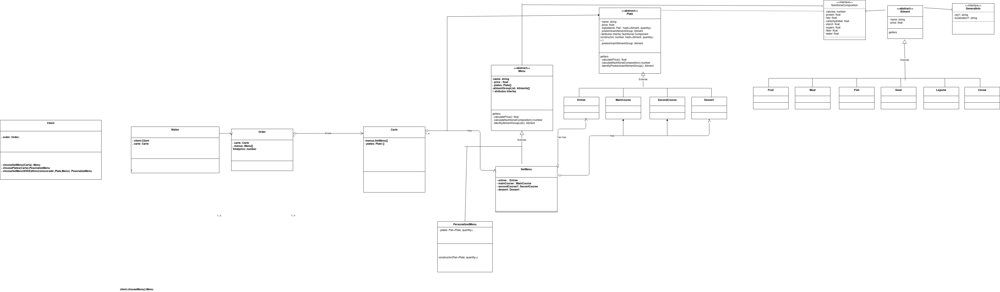
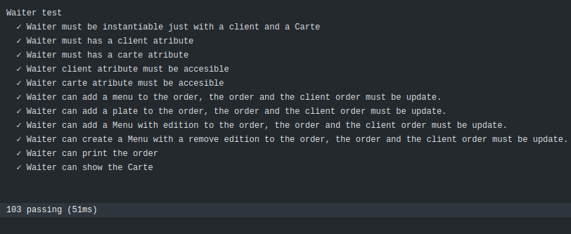
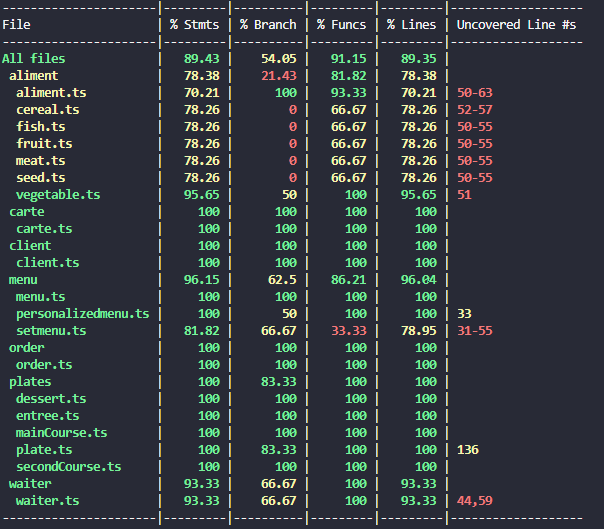
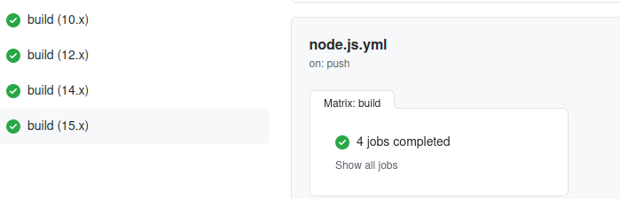

# INFORME PRÁCTICA 7 - Modelo de datos de un sistema que permite el diseño de menús
## Escuela superior de ingeniería informática
### Desarrollo de Sistemas Informáticos
#### Leonardo Dorta Bejarano
#### Elvis Nogueiras
#### José Daniel Fuentes Marra
#### Carla Fernanda Flores

## Introducción

En esta práctica grupal desarrollaremos un sistema de diseño de menú, mediante todos loc contenidos visto a lo largo de la asignatura, relacionado son [Typescript](https://www.typescriptlang.org/) explicando las clases que vamos a usar para llevar a cabo este diseño. Dentro del desarrollo utilizaremos [TypeDoc](https://typedoc.org/) que adoptará la metodología TDD.

## Metodología

Para realizar la práctica, y este informe, se uso la siguiente metodología:

Para cada ejercicio:

1. Se configuró apropiadamente el entorno

2. Al hacer TDD, debemos de escribir las pruebas primero. Estas deben de fallar.

3. Se escribe el código. Esperando a que pase todas las pruebas implementadas

4. En caso de que sea necesario, se retoca el código.

5. Mediante [Typedoc](https://typedoc.org/) se genera la documentación para las funciones y los tipos

6. Verificar mediante [Istambul](https://istanbul.js.org/) el cubrimiento del código

7. Mediante [Github Action](https://github.com/features/actions) se realiza integración continua de todos los test, en las diferentes versiones de Node.js cubrimiento del código

8. Usando [Inquirer.js](https://www.npmjs.com/package/inquirer), se permite la creación de alimentos mediante una linea de comandos  interactiva, ademas de visualizar menus, alimentos, platos, entre otros.

9. Se generó este informe

## Planificación

Para la planificación grupal del proyecto, realizamos los siguientes pasos:

1. Se realizó un [Diagrama de Clases UML](https://es.wikipedia.org/wiki/Diagrama_de_clases), para así poder planificar la estructura de las clases, asi como la interacción entre ellas.

2. Se configuró apropiadamente el inicio de la práctica, instalando las dependencias necesarias, y dejando como base en el repositorio [Github](https://github.com/)

3. Se repartio el trabajo a desarrollar de la siguiente manera

|             | Clases                      | Test | Documentación | Informe |
|-------------|-----------------------------|------|---------------|---------|
| Fernanda    | Alimentos                   | ✔️    | ✔️             | ✔️       |
| Jose Daniel | Platos                      | ✔️    | ✔️             | ✔️       |
| Elvis       | Menus                       | ✔️    | ✔️             | ✔️       |
| Leonardo    | Cliente Comanda Orden Carta | ✔️    | ✔️             | ✔️       |

Cada quien se encargo de una parte del diagrama, implementando sus respectivos Test y documentación, así como la parte de este informe. 

El trabajo se utilizo mediante la creación de ramas aparte de la `master` branch

4. Una vez terminado el trabajo individual, mediante el uso de [Pull Request](https://styde.net/pull-request-en-github/), se pudo fusionar exitosamente los trabajos individuales. Revisando conflictos de fusión, asi como el correcto funcionamiento de los test. Usando Github action, asi como la verificación de la integración continua para las diferentes versiones de Node.js.

### [Diagrama UML](https://drive.google.com/file/d/1ar6GoOVRoRpiqG0OEq_zP4KjB6s-EQdx/view?usp=sharing) 

Cabe destacar que el diagrama UML implementado es meramente un esquema inicial del trabjo, a sufrido pequeños cambios, pero en cuanto a estructura y relaciones, sigue siendo el mismo.

Puede acceder a este a [aquí](https://drive.google.com/file/d/1ar6GoOVRoRpiqG0OEq_zP4KjB6s-EQdx/view?usp=sharing)
 





El diagrama se compone principalmente en las siguientes partes:

1) **Alimentos**
  - Una clase abstracta `aliment`
  - Sus Clases Hijas: `Fruit`, `Meat` ...
  - La interfaz `NutritionalComposition`
  - La interfaz `General Info`

2) **Parte de platos**
  - Una clase abstracta `Plate`
  - Sus Clases Hijas: `Entree`, `MainCourse`, `SecondCourse`, `Dessert`

3) **Parte de Menu**
  - Una clase abstracta `Menu`
  - Sus Clases Hijas: `SetMenu`, `PersonalizedMenu` ...

4) **Parte del cliente**
  - Las clases `Carte`, `Waiter`, `Order`, `Client`


### Implementación.

A continuación, se pretende explicar cada una de las clase implementadas, asi como su funcionamieto.

#### Aliment Clases

**CLASE ABSTRACTA `<ALIMENT>`.**

Hemos desarrollado una clase **abstracta aliment** para que a partir de ella podamos implementar las categorias de los alimentos. A demás, tiene la implementación de dos interfaces, esto es para si en un futuro queremos añadir o quitar código sin que afecte a la clase `<Aliment>` como tal.

La clase Aliment contiene dos atributos: `<name>` el nombre del alimento, y `<price>` el precio del alimento. 

```ts
     public readonly name: string;
     public readonly price: number;
```

A parte hemos declarado un `<enum>` llamado grupo de alimento, para identificar el tipo de alimento que es.

```ts
export enum alimentGroup {
    Fruit = 'Fruit',
    Meat = 'Meat',
    Fish = 'Fish',
    Seed = 'Seed',
    Legume = 'Legume',
    Cereal = "Cereal",
    Vegetable = "Vegetable"
  }
```

Ahora veremos la implementación de las demas clases, las cuales definen la categoria de un alimento.

Estas clases están implementadas con la clase abstracta **aliment**.
* CLASE FRUIT
* CLASE VEGETABLE
* CLASE LEGUME
* CLASE SEED
* CLASE FISH
* CLASE MEAT

Explicaremos el desarrollo de una de estas clases:

**CLASE FISH**

Esta clase representa a la categoria de un alimento. En este caso representa a carnes de pescado.

Esta contiene como atributos a:
```
private readonly AlimentGroup: alimentGroup = alimentGroup.Fish
```
Que es de tipo de grupo de alimentos, para identificar que es alimemto Fish.

El constructor está desarrollado de la siguiete manera:
```ts
constructor( public readonly name: string,
        public readonly price: number,
        public readonly protein: number,
        public readonly fats: number,
        public readonly carbohydrates: number,
        public readonly calories:number,
        public readonly starch: number,
        public readonly sugars: number,
        public readonly fiber: number,
        public readonly water: number,
        public readonly locality: string,
        public readonly city: string) {
      super(name, price, protein, fats, carbohydrates, calories, starch, sugars, fiber, water, locality, city);
    }
```
donde `<name>` y `<price>` sos atributos que tiene que llevar porque estas clases son un extends de `<Aliment>`, y por ende deben tener estos atributos. Tambien tienen los atributos `<protein>` , `<fats>`, `<sugars>`, `<water>`, `<fiber>`, `<starch>`, `<calories>` y `<carbohydrates>`, que son de la interfaz llamada **composicion_nutritional** que acontinuiación veremos a detalle estas interfaces. Los atributos `<locality>` y `<city>` son para especificar de donde proceden esos alimentos.

Las funciones que implementan estas clases extendidas son las siguientes:

```ts
 printAliment(): string {
      const aliment_aux = new Fish(this.getName(), this.getPriceOfAliment(), this.getProtein(), this.getFats(), this.getCarbohydrates(), this.getCalories(), this.getStarch(), this.getSugars(), this.getFiber(), this.getWater(), this.getLocality(), this.getCity());
      if (typeof aliment_aux == "undefined") {
        return ("error, no definido");
      }
      console.log(`${aliment_aux.getName()}` + "precio:" + `${aliment_aux.getPriceOfAliment()}`);
      return (`alimento:${aliment_aux.getName()},` + " " + "precio:" + `${aliment_aux.getPriceOfAliment()}` + " " + `cantidad de proteianas:${aliment_aux.getProtein()}, cantidad de lipidos: ${aliment_aux.getFats()}, cantidad de carbohidratos: ${aliment_aux.getCarbohydrates()}`);
    }
```
Esta función imprime el alimento formateado, es decir, el nombre de dicho alimento, la composición nutricional y el origen del alimento. La salida seria esta:

> alimento:lechuga, precio:1 cantidad de proteianas:14, cantidad de lipidos: 1.34, cantidad de carbohidratos: 0.2 

Esta función es de tipo alimentGroup porque queremos que nos retorne el tipo de alimento que es.

```ts
  getAlimentGroup(): alimentGroup {
      return this.AlimentGroup;
    }
```

Ahora explicaremos las interfaces que hemos implementado para llevar a cabo el alimento.

**INTERFAZ COMPOSISCION NUTRICIONAL**

```ts
export interface CompositionNutritional {
    protein: number;
    fats: number;
    carbohydrates: number;
    calories: number;
    starch: number;
    sugars: number;
    fiber: number;
    water:number;
    getCalories():number | undefined;
    getProtein(): number;
    getFats():number;
    getCarbohydrates(): number;
    getStarch():number | undefined;
    getSugars():number | undefined;
    getFiber(): number | undefined;
    getWater(): number | undefined;
}
``` 

Como podemos apreciar, esta interfaz implementa la composisción del alimento; las calorias, carbohidratos, proteinas,etc. para luego calcular el valor nutricional del plato y de los menus formados por estos alimentos.

**INTERFAZ GENRAL INFO**
Esta interfaz representa la información adicional de un alimento, es decir, lugar de donde provien y demas. Se ha diseñado de esta manera para que en un futuro podamos agregar con facilidad.
```ts
export interface GeneralInfo{
    locality?: string;
    city?: string;
    getLocality(): string | undefined;
    getCity(): string | undefined;
}
```
#### Plate Classes
La clase `Plate` será la encargada de almacenar la información correspondiente a los platos, para ello, seguimos la siguiente composición.

1. Tenemos una Clase abstracta `abstract class Plate`, la cual posee la información básica para el correcto funcionamiento de esta clase.

2. De esta derivan las subclases `Entree`, `MainCourse`, `SecondCourse`, `Dessert`. De esta forma, proximamente  de cara a los menus, podemos exigir que contenga extrictamente un menu de cada tipo.
##### Plate Class

```ts
/* eslint-disable max-len */
import {Aliment, alimentGroup} from "../aliment/aliment";
import {CompositionNutritional} from "../aliment/nutritional_composition_interface";
/**
 * Clase abstracta para representar platos
 */
export abstract class Plate implements CompositionNutritional {
  /**
   * Variables para almacenar la composicion nutricional de cada plato
   */
    public calories: number = 0;
    public protein: number = 0;
    public fats: number = 0;
    public carbohydrates: number = 0;
    public starch: number = 0;
    public sugars: number = 0;
    public fiber: number = 0;
    public water: number = 0;
    private price: number = 0;
    private predominantAlimentGroup: [alimentGroup, number] = [alimentGroup.Cereal, 0];
    /**
     * Constructor de la clase plate
     * @param name Nombre del plato
     * @param ingredients Ingredientes del plato
     */
    constructor(private name: string,
    private ingredients: Map<Aliment, number>) {
      this.calculatePrice();
      this.identifyPredominantAlimentGroup();
      this.calculateNutritionalComposition();
    }
    /**
     * Get para el nombre del plato
     * @returns Nombre del plato
     */
    getName(): string {
      return this.name;
    }
    /**
     * Get para el precio del plato
     * @returns Precio del plato
     */
    getPrice(): number {
      return this.price;
    }
    /**
     * Get del grupo alimenticio del plato
     * @returns Grupo alimenticio predominante del plato
     */
    getPredominantAlimentGroup(): [alimentGroup, number] {
      return this.predominantAlimentGroup;
    }
    /**
     * Get para los ingredientes del plato
     * @returns String con los ingredientes del plato
     */
    getIngredients(): string {
      let output = "";
      this.ingredients.forEach((value, key) => {
        output += "Ingrediente: " + key.getName() + ", Cantidad: " + value + "\n";
      });
      return output;
    }
    /**
     * Get de las calorias del plato
     * @returns Calorias del plato
     */
    getCalories(): number {
      return this.calories;
    }
    /**
     * Get de las proteinas del plato
     * @returns Proteinas del plato
     */
    getProtein(): number {
      return this.protein;
    }
    /**
     * Get para las grasas del plato
     * @returns Grasas del plato
     */
    getFats(): number {
      return this.fats;
    }
    /**
     * Get para los carbohidratos del plato
     * @returns Carbohidratos del plato
     */
    getCarbohydrates(): number {
      return this.carbohydrates;
    }
    /**
     * Get para el almidon del plato
     * @returns Almidon del plato
     */
    getStarch(): number {
      return this.starch;
    }
    /**
     * Get para el azucar del plato
     * @returns Azucar del plato
     */
    getSugars(): number {
      return this.sugars;
    }
    /**
     * Get para la fibra del plato
     * @returns Fibra del plato
     */
    getFiber(): number {
      return this.fiber;
    }
    /**
     * Get del agua del plato
     * @returns Agua del plato
     */
    getWater(): number {
      return this.water;
    }
    /**
     * Funcion para calcular el precio total del plato segun el precio de cada alimento
     */
    private calculatePrice() {
      this.ingredients.forEach((value, key) => {
        this.price += key.getPriceOfAliment();
      });
    }
    /**
     * Funcion para identificar el grupo de alimentos predominante en el plato
     */
    private identifyPredominantAlimentGroup() {
      const max: Map<alimentGroup, number> = new Map();
      this.ingredients.forEach((value, key) => {
        if (max.has(key.getAlimentGroup())) {
          const sum = max.get(key.getAlimentGroup());
          max.set(key.getAlimentGroup(), sum == undefined? 0: sum + value);
        } else {
          max.set(key.getAlimentGroup(), value);
        }
      });
      max.forEach((value, key) => {
        if (value == Math.max(...max.values())) {
          this.predominantAlimentGroup = [key, value];
        }
      });
    }
    /**
     * Funcion para calcular la composicion nutricional total del plato
     */
    private calculateNutritionalComposition() {
      this.ingredients.forEach((value, key) => {
        this.calories += key.getCalories();
        this.protein += key.getProtein();
        this.fats += key.getFats();
        this.carbohydrates += key.getCarbohydrates();
        this.starch += key.getStarch();
        this.sugars += key.getSugars();
        this.fiber += key.getFiber();
        this.water += key.getWater();
      });
    }
    /**
     * Funcion para imprimir todas las caracteristicas de un plato
     * @returns String con la estructura del plato
     */
    print(): string {
      let output = "";
      output += "Nombre: " + this.getName() + "\n";
      output += "Precio: " + this.getPrice() + "\n";
      output += "Ingredientes: \n" + this.getIngredients() + "\n";
      output += "Composicion Nutricional: " + "\n";
      output += "Calorias: " + this.getCalories() + "\n";
      output += "Proteinas: " + this.getProtein() + "\n";
      output += "Grasas: " + this.getFats() + "\n";
      output += "Carbohidratos: " + this.getCarbohydrates() + "\n";
      output += "Almidon: " + this.getStarch() + "\n";
      output += "Azucar: " + this.getSugars() + "\n";
      output += "Fibra: " + this.getFiber() + "\n";
      output += "Agua: " + this.getWater() + "\n";
      output += "Grupo de alimento predominante: " + this.getPredominantAlimentGroup() + "\n";
      return output;
    }
}

```

Como se mencionó anteriormente, esta abstracta, contiene la informacion básica de platos

Esta contiene:

- La composición nutricional básica, es decir, implementa la interfaz CompositionalNutrition 

```ts
export abstract class Plate implements CompositionNutritional {
    public calories: number = 0;
    public protein: number = 0;
    public fats: number = 0;
    public carbohydrates: number = 0;
    public starch: number = 0;
    public sugars: number = 0;
    public fiber: number = 0;
    public water: number = 0;
    private price: number = 0;

```

Por otro lado, pose una tupla `predominantAlimentGroup`, para poder almancenar el Grupo predominante del alimento en el plato.

```ts
     private predominantAlimentGroup: [alimentGroup, number] = [alimentGroup.Cereal, 0];

```

En cuanto al constructor, recibe un nombre `name` y un mapa ` Map<Aliment, number>) `mediante el cual se podrá almacenar los alimentos que posee y su cantidad

```ts
  constructor(private name: string,
  private ingredients: Map<Aliment, number>) {
  this.calculatePrice();
  this.identifyPredominantAlimentGroup();
  this.calculateNutritionalComposition();
  }

```

Internamente el constructor llama a los siguiente métodos privados:

1. `calculatePrice()`


```ts
  private calculatePrice() {
  this.ingredients.forEach((value, key) => {
    this.price += key.getPriceOfAliment();
  });
```

Calcula del plato, recorriendo sus alimentos y acumulando su precio

2. `identifyPredominantAlimentGroup();`

```ts
    private identifyPredominantAlimentGroup() {
    const max: Map<alimentGroup, number> = new Map();
    this.ingredients.forEach((value, key) => {
      if (max.has(key.getAlimentGroup())) {
        const sum = max.get(key.getAlimentGroup());
        max.set(key.getAlimentGroup(), sum == undefined? 0: sum + value);
      } else {
        max.set(key.getAlimentGroup(), value);
      }
    });
    max.forEach((value, key) => {
      if (value == Math.max(...max.values())) {
        this.predominantAlimentGroup = [key, value];
      }
    });
  }

```

Este método identifica la tipo de alimento predomintan, recorriendo los alimentos entre si, observando cual de ellos posee la mayor, cantidad

3 `calculateNutritionalComposition()`

```ts 
    private calculateNutritionalComposition() {
      this.ingredients.forEach((value, key) => {
        this.calories += key.getCalories();
        this.protein += key.getProtein();
        this.fats += key.getFats();
        this.carbohydrates += key.getCarbohydrates();
        this.starch += key.getStarch();
        this.sugars += key.getSugars();
        this.fiber += key.getFiber();
        this.water += key.getWater();
      });
```

Recorriendo el `Map` de alimentos `private ingredients: Map<Aliment, number>` se acumulan los repectivos valores de la composición nutritional.

Ademas de los `get()`, de esta clase, es posible mostrar la información mediante el método `print()` de la clase

```ts
    print(): string {
      let output = "";
      output += "Nombre: " + this.getName() + "\n";
      output += "Precio: " + this.getPrice() + "\n";
      output += "Ingredientes: \n" + this.getIngredients() + "\n";
      output += "Composicion Nutricional: " + "\n";
      output += "Calorias: " + this.getCalories() + "\n";
      output += "Proteinas: " + this.getProtein() + "\n";
      output += "Grasas: " + this.getFats() + "\n";
      output += "Carbohidratos: " + this.getCarbohydrates() + "\n";
      output += "Almidon: " + this.getStarch() + "\n";
      output += "Azucar: " + this.getSugars() + "\n";
      output += "Fibra: " + this.getFiber() + "\n";
      output += "Agua: " + this.getWater() + "\n";
      output += "Grupo de alimento predominante: " + this.getPredominantAlimentGroup() + "\n";
      return output;
    }
```

##### Entree, MainCourse, SecondCourse y Dessert Classes


**Entree**
```ts
  /* eslint-disable max-len */
import {Aliment} from "../aliment/aliment";
import {Plate} from "./plate";
/**
 * Clase para representar un plato entrante
 */
export class Entree extends Plate {
  /**
   * Constructor de la clase Entree
   * @param name Nombre del plato
   * @param ingredients Ingredientes del plato
   */
  constructor(name: string,
      ingredients: Map<Aliment, number>) {
    super(name, ingredients);
  }
}

```
**MainCourse**
```ts
 import {Aliment} from "../aliment/aliment";
import {Plate} from "./plate";
/**
 * Clase para representar un plato principal
 */
export class MainCourse extends Plate {
  /**
   * Constructor de la clase MainCourse
   * @param name Nombre del plato
   * @param ingredients Ingredientes del plato
   */
  constructor(name: string,
      ingredients: Map<Aliment, number>) {
    super(name, ingredients);
  }
}
```
**SecondCourse**

```ts
import {Aliment} from "../aliment/aliment";
import {Plate} from "./plate";
/**
 * Clase para representar un plato secundario
 */
export class SecondCourse extends Plate {
  /**
   * Constructor de la clase SecondCourse
   * @param name Nombre del plato
   * @param ingredients Ingredientes del plato
   */
  constructor(name: string,
      ingredients: Map<Aliment, number>) {
    super(name, ingredients);
  }
} 

```

Basicamente estas clases permiten que la clase `SetMenu` pueda tener extrictamente un entrante, primer plato, y un postre

#####  Test

Cada clase posee sus respectivos test, a exepción de la clase abstracta `Plate`

**Entree**
```ts
/* eslint-disable max-len */
import 'mocha';
import {expect} from 'chai';
import {Cereal} from "../../src/aliment/cereal";
import {Fish} from "../../src/aliment/fish";
import {Fruit} from "../../src/aliment/fruit";
import {Entree} from "../../src/plates/entree";

describe(`Entree Tests`, () => {
  const Arroz = new Cereal("Arroz Blanco", 0.25, 7, 0.12, 86, 4, 85.8, 0.2, 0.2, 5.9, "Miramar", "Santa Cruz");
  const Anguila = new Fish("Anguila", 6.50, 16.3, 32, 0, 25, 0, 0, 0, 68.2, "Wuhan", "China");
  const Aguacate = new Fruit("Aguacate", 2.80, 1.5, 2.5, 5.9, 13, 0, 5.9, 1.8, 78.8, "Sabadell", "Barcelona");

  const map = new Map();
  map.set(Arroz, 70);
  map.set(Anguila, 15);
  map.set(Aguacate, 15);

  const Entrante = new Entree("Maki Sushi", map);

  it('Entrante.getName() returns value Maki Sushi', () => {
    expect(Entrante.getName()).to.equal("Maki Sushi");
  });
  it('Entrante.getPrice() returns value 9.55', () => {
    expect(Entrante.getPrice()).to.equal(9.55);
  });
  it('Entrante.getPredominantAlimentGroup() returns value [Cereal, 70]', () => {
    expect(Entrante.getPredominantAlimentGroup()).to.deep.equal(['Cereal', 70]);
  });
  it('Entrante.getIngredients() returns value -Ingrediente: Arroz Blanco, Cantidad: 70 -Ingrediente: Anguila, Cantidad: 15 -Ingrediente: Aguacate, Cantidad: 15', () => {
    expect(Entrante.getIngredients()).to.equal("Ingrediente: Arroz Blanco, Cantidad: 70\nIngrediente: Anguila, Cantidad: 15\nIngrediente: Aguacate, Cantidad: 15\n");
  });
  it('Entrante.getCalories() returns value 42', () => {
    expect(Entrante.getCalories()).to.equal(42);
  });
  it('Entrante.getCarbohydrates() returns value 91.9', () => {
    expect(Entrante.getCarbohydrates()).to.equal(91.9);
  });
  it('Entrante.getFats() returns value 34.62', () => {
    expect(Entrante.getFats()).to.equal(34.62);
  });
  it('Entrante.getFiber() returns value 2', () => {
    expect(Entrante.getFiber()).to.equal(2);
  });
  it('Entrante.getProtein() returns value 24.8', () => {
    expect(Entrante.getProtein()).to.equal(24.8);
  });
  it('Entrante.getStarch() returns value 85.8', () => {
    expect(Entrante.getStarch()).to.equal(85.8);
  });
  it('Entrante.getSugars() returns value 6.1000000000000005', () => {
    expect(Entrante.getSugars()).to.equal(6.1000000000000005);
  });
  it('Entrante.getWater() returns value 152.9', () => {
    expect(Entrante.getWater()).to.equal(152.9);
  });
});

```
**MainCourse**
```ts
/* eslint-disable max-len */
import 'mocha';
import {expect} from 'chai';
import {Vegetable} from "../../src/aliment/vegetable";
import {Seed} from "../../src/aliment/seed";
import {Meat} from "../../src/aliment/meat";
import {MainCourse} from "../../src/plates/mainCourse";

describe(`MainCourse Tests`, () => {
  const Apio = new Vegetable("Apio", 1.80, 1.30, 2.5, 1.3, 3.5, 0, 1.3, 1.8, 95.4, "Miramar", "Santa Cruz");
  const Lentejas = new Seed("Lentejas", 3.5, 24.3, 9.5, 48.8, 12.5, 44.5, 1.2, 11.7, 10.8, "Wuhan", "China");
  const Tocino = new Meat("Tocino", 6.50, 8.4, 85.8, 0, 55.5, 0, 0, 0, 12.5, "Sabadell", "Barcelona");

  const map = new Map();
  map.set(Apio, 15);
  map.set(Lentejas, 25);
  map.set(Tocino, 60);

  const Principal = new MainCourse("Cachopo", map);

  it('Principal.getName() returns value Cachopo', () => {
    expect(Principal.getName()).to.equal("Cachopo");
  });
  it('Principal.getPrice() returns value 11.8', () => {
    expect(Principal.getPrice()).to.equal(11.8);
  });
  it('Principal.getPredominantAlimentGroup() returns value [Meat, 60]', () => {
    expect(Principal.getPredominantAlimentGroup()).to.deep.equal(['Meat', 60]);
  });
  it('Principal.getIngredients() returns value -Ingrediente: Apio, Cantidad: 15 -Ingrediente: Lentejas, Cantidad: 25 -Ingrediente: Tocino, Cantidad: 60', () => {
    expect(Principal.getIngredients()).to.equal("Ingrediente: Apio, Cantidad: 15\nIngrediente: Lentejas, Cantidad: 25\nIngrediente: Tocino, Cantidad: 60\n");
  });
  it('Principal.getCalories() returns value 71.5', () => {
    expect(Principal.getCalories()).to.equal(71.5);
  });
  it('Principal.getCarbohydrates() returns value 50.099999999999994', () => {
    expect(Principal.getCarbohydrates()).to.equal(50.099999999999994);
  });
  it('Principal.getFats() returns value 97.8', () => {
    expect(Principal.getFats()).to.equal(97.8);
  });
  it('Principal.getFiber() returns value 13.5', () => {
    expect(Principal.getFiber()).to.equal(13.5);
  });
  it('Principal.getProtein() returns value 34', () => {
    expect(Principal.getProtein()).to.equal(34);
  });
  it('Principal.getStarch() returns value 44.5', () => {
    expect(Principal.getStarch()).to.equal(44.5);
  });
  it('Principal.getSugars() returns value 2.5', () => {
    expect(Principal.getSugars()).to.equal(2.5);
  });
  it('Principal.getWater() returns value 118.7', () => {
    expect(Principal.getWater()).to.equal(118.7);
  });
});
```

**SecondCourse**
```ts
 /* eslint-disable max-len */
import 'mocha';
import {expect} from 'chai';
import {Fish} from "../../src/aliment/fish";
import {Fruit} from "../../src/aliment/fruit";
import {Meat} from "../../src/aliment/meat";
import {SecondCourse} from "../../src/plates/secondCourse";

describe(`SecondCourse Tests`, () => {
  const Rodaballo = new Fish("Rodaballo", 15, 16.1, 4, 0, 5, 0, 0, 0, 80.3, "Miramar", "Santa Cruz");
  const UvasNegras = new Fruit("Uvas Negras", 12, 0.6, 0.5, 15.5, 6, 0, 15.5, 0.4, 83.5, "Wuhan", "China");
  const Panceta = new Meat("Panceta", 8, 12.5, 50, 0, 45, 0, 0, 0, 40.9, "Sabadell", "Barcelona");

  const map = new Map();
  map.set(Rodaballo, 20);
  map.set(UvasNegras, 12);
  map.set(Panceta, 45);

  const Secundario = new SecondCourse("Rodaballo Frito", map);

  it('Secundario.getName() returns value Rodaballo Frito', () => {
    expect(Secundario.getName()).to.equal("Rodaballo Frito");
  });
  it('Secundario.getPrice() returns value 35', () => {
    expect(Secundario.getPrice()).to.equal(35);
  });
  it('Secundario.getPredominantAlimentGroup() returns value [Meat, 45]', () => {
    expect(Secundario.getPredominantAlimentGroup()).to.deep.equal(['Meat', 45]);
  });
  it('Secundario.getIngredients() returns value -Ingrediente: Rodaballo, Cantidad: 20 -Ingrediente: Uvas Negras, Cantidad: 12 -Ingrediente: Panceta, Cantidad: 45', () => {
    expect(Secundario.getIngredients()).to.equal("Ingrediente: Rodaballo, Cantidad: 20\nIngrediente: Uvas Negras, Cantidad: 12\nIngrediente: Panceta, Cantidad: 45\n");
  });
  it('Secundario.getCalories() returns value 56', () => {
    expect(Secundario.getCalories()).to.equal(56);
  });
  it('Secundario.getCarbohydrates() returns value 15.5', () => {
    expect(Secundario.getCarbohydrates()).to.equal(15.5);
  });
  it('Secundario.getFats() returns value 54.5', () => {
    expect(Secundario.getFats()).to.equal(54.5);
  });
  it('Secundario.getFiber() returns value 0.4', () => {
    expect(Secundario.getFiber()).to.equal(0.4);
  });
  it('Secundario.getProtein() returns value 29.200000000000003', () => {
    expect(Secundario.getProtein()).to.equal(29.200000000000003);
  });
  it('Secundario.getStarch() returns value 0', () => {
    expect(Secundario.getStarch()).to.equal(0);
  });
  it('Secundario.getSugars() returns value 15.5', () => {
    expect(Secundario.getSugars()).to.equal(15.5);
  });
  it('Secundario.getWater() returns value 204.70000000000002', () => {
    expect(Secundario.getWater()).to.equal(204.70000000000002);
  });
});
```
 
**Dessert**

```ts
 
/* eslint-disable max-len */
import 'mocha';
import {expect} from 'chai';
import {Fish} from "../../src/aliment/fish";
import {Fruit} from "../../src/aliment/fruit";
import {Meat} from "../../src/aliment/meat";
import {Dessert} from "../../src/plates/dessert";

describe(`Dessert Tests`, () => {
  const Salmon = new Fish("Salmon", 9, 18.4, 12, 0, 11, 0, 0, 0, 69.6, "Miramar", "Santa Cruz");
  const Chufa = new Fruit("Chufa", 7, 6.1, 5, 42.5, 24, 0, 14.7, 17.4, 10.3, "Wuhan", "China");
  const Ballena = new Meat("Ballena", 43, 23.2, 80, 0, 45, 0, 0, 0, 73.4, "Sabadell", "Barcelona");

  const map = new Map();
  map.set(Salmon, 20);
  map.set(Chufa, 12);
  map.set(Ballena, 45);

  const Postre = new Dessert("Di mare", map);

  it('Postre.getName() returns value Di mare', () => {
    expect(Postre.getName()).to.equal("Di mare");
  });
  it('Postre.getPrice() returns value 59', () => {
    expect(Postre.getPrice()).to.equal(59);
  });
  it('Postre.getPredominantAlimentGroup() returns value [Meat, 45]', () => {
    expect(Postre.getPredominantAlimentGroup()).to.deep.equal(['Meat', 45]);
  });
  it('Postre.getIngredients() returns value -Ingrediente: Salmon, Cantidad: 20 -Ingrediente: Chufa, Cantidad: 12 -Ingrediente: Ballena, Cantidad: 45', () => {
    expect(Postre.getIngredients()).to.equal("Ingrediente: Salmon, Cantidad: 20\nIngrediente: Chufa, Cantidad: 12\nIngrediente: Ballena, Cantidad: 45\n");
  });
  it('Postre.getCalories() returns value 80', () => {
    expect(Postre.getCalories()).to.equal(80);
  });
  it('Postre.getCarbohydrates() returns value 42.5', () => {
    expect(Postre.getCarbohydrates()).to.equal(42.5);
  });
  it('Postre.getFats() returns value 97', () => {
    expect(Postre.getFats()).to.equal(97);
  });
  it('Postre.getFiber() returns value 17.4', () => {
    expect(Postre.getFiber()).to.equal(17.4);
  });
  it('Postre.getProtein() returns value 47.7', () => {
    expect(Postre.getProtein()).to.equal(47.7);
  });
  it('Postre.getStarch() returns value 0', () => {
    expect(Postre.getStarch()).to.equal(0);
  });
  it('Postre.getSugars() returns value 14.7', () => {
    expect(Postre.getSugars()).to.equal(14.7);
  });
  it('Postre.getWater() returns value 153.3', () => {
    expect(Postre.getWater()).to.equal(153.3);
  });
});

```
### Clase Menu

Menu es una clase abstracta principal (padre) del sistema de menus, las clases SetMenu y PesonalizedMenu heredan de esta, esta clase implementa la interfaz de la composicion nutricional para que con el metodo calculateNutritionalComposition() se pueda calcular el total de la composicion nutricional del menu en base a cada plato, por otro lado, tambien tiene los metodos calculatePrice() e identifyAlimentGroupList() para calcular el precio total del menu y identificar los alimentos principales que estan en el menu respectivamente por cada plato.

~~~~ts
/**
 * Clase Padre que gestiona la creacion de menus personalizados o preestablecidos
 */
export abstract class Menu implements CompositionNutritional {
    public protein: number = 0;
    public fats: number = 0;
    public carbohydrates: number = 0;
    public calories: number = 0;
    public starch: number = 0;
    public sugars: number = 0;
    public fiber: number = 0;
    public water:number = 0;
    private price : number = 0;
    private alimentGroupList : [alimentGroup, number][] = [];
    protected plates : Plate[] = []
    /**
     * 
     * @param name Nombre del menu
     */
    constructor(public readonly name:string) {
    }

    /**
     * Metodo que calcula el precio total del menu en base a los platos que lo compone.
     */
    protected calculatePrice() {
      this.plates.forEach((key) => {
        this.price += key.getPrice();
      });
    }

    /**
     * Metodo que calcula la composicion nutricional del menu en base a los platos que lo conforman.
     */
    protected calculateNutritionalComposition() {
      this.plates.forEach((key) => {
        this.calories += key.getCalories();
        this.protein += key.getProtein();
        this.fats += key.getFats();
        this.carbohydrates += key.getCarbohydrates();
        this.starch += key.getStarch();
        this.sugars += key.getSugars();
        this.fiber += key.getFiber();
        this.water += key.getWater();
      });
    }

    /**
     * Metodo que obtiene el alimento predominante de cada plato en el menu.
     */
    protected identifyAlimentGroupList() {
      this.plates.forEach((key) => {
        this.alimentGroupList.push(key.getPredominantAlimentGroup());
      });
    }

    /**
     * Metodo que retorna el numero de calorias del menu.
     * @returns caloras totales del menu.
     */
    getCalories():number {
      return this.calories;
    }

    /**
     * Metodo que retorna el numero de proteinas del menu.
     * @returns Proteinas totales del menu.
     */
    getProtein(): number {
      return this.protein;
    }

    /**
     * Metodo que retorna el numero de grasas del menu.
     * @returns Grasas totales del menu.
     */
    getFats():number {
      return this.fats;
    }

    /**
     * Metodo que retorna el numero de carbohidratos del menu.
     * @returns Cabohidratos totales del menu.
     */
    getCarbohydrates(): number {
      return this.carbohydrates;
    }

    /**
     * Metodo que retorna el numero de almidon del menu.
     * @returns Almidon total del menu
     */
    getStarch():number {
      return this.starch;
    }

    /**
     * Metodo que retorna el numero de azucares del menu.
     * @returns Azucares totales del menu.
     */
    getSugars():number {
      return this.sugars;
    }

    /**
     * Metodo que retorna el numero de fibra del menu.
     * @returns Fibra total del menu
     */
    getFiber(): number {
      return this.fiber;
    }

    /**
     * Metodo que retorna el numero de agua del menu.
     * @returns Cantidad de agua total del mnu.
     */
    getWater(): number {
      return this.water;
    }

    /**
     * Metodo que retorna el precio del menu.
     * @returns Precio total del menu.
     */
    getPrice() : number {
      return this.price;
    }

    /**
     * Metodo que retorna todos los platos que conforman el menu.
     * @returns Platos que conforman el menu.
     */
    getPlates(): Plate[] {
      return this.plates;
    }

    /**
     * Metodo que devuelve el grupo de alimento predominante por cada plato que conforma el menu.
     * @returns Alimento predominante de cada plato.
     */
    getAlimentGroupList() : [alimentGroup, number][] {
      return this.alimentGroupList;
    }

    /**
     * Metodo que devuelve la informacion del menu.
     * @returns 
     */
    print() : string {
      let output = "";
      output += "Nombre: " + this.name + "\n";
      output += "Precio: " + this.getPrice() + "\n";
      output += "Platos: \n" 
      this.plates.forEach((element) => {
        output += "Nombre : " + element.getName() + "\n Precio : " + element.getPrice() + "\n";
      }); + "\n";
      output += "Composicion Nutricional: " + "\n";
      output += "Calorias: " + this.getCalories() + "\n";
      output += "Proteinas: " + this.getProtein() + "\n";
      output += "Grasas: " + this.getFats() + "\n";
      output += "Carbohidratos: " + this.getCarbohydrates() + "\n";
      output += "Almidon: " + this.getStarch() + "\n";
      output += "Azucar: " + this.getSugars() + "\n";
      output += "Fibra: " + this.getFiber() + "\n";
      output += "Agua: " + this.getWater() + "\n";
      output += "Grupo de alimento predominante: " + this.getAlimentGroupList() + "\n";
      return output;
    }
}

~~~~


### SetMenu

La clase SetMenu esta pensada para la creacion de menus predefinidos por el local, para ello el constructor pide el nombre del menu, un plato de entrada, un plato principal, un postre y un plato secundario que es opcional, al ser esta clase hija de la clase Menu se llaman a las clases calculatePrice(), calculateNutritionalComposition() y identifyAlimentGroupList() para calcular todos los atributos.

~~~ts
/**
 * Clase para crear Menus preestablecidos segun el plato de entrada, plato principal, segundo plato si es que tiene y postre.
 */
export class SetMenu extends Menu {
  constructor(name: string, private entree: Entree, private mainCourse: MainCourse, private dessert: Dessert, private secondCourse?: SecondCourse) {
    super(name);
    if (secondCourse) {
      this.setPlates(entree, mainCourse, dessert, secondCourse);
    } else {
      this.setPlates(entree, mainCourse, dessert);
    }

    this.calculatePrice();
    this.calculateNutritionalComposition();
    this.identifyAlimentGroupList();
  }

  /**
   * Metodo que obtiene el plato de entrada.
   * @returns Plato de entrada.
   */
  getEntree() : Entree {
    return this.entree;
  }

  /**
   * Metodo que obtiene el plato principal.
   * @returns Plato principal.
   */
  getMainCourse() : MainCourse {
    return this.mainCourse;
  }

  /**
   * Metodo que obtiene el plato postre.
   * @returns Plato postre.
   */
  getdDessert() : Dessert {
    return this.dessert;
  }

  /**
   * Metodo que obtiene el plato secundario, en caso de no tener, devuelve el plato principal.
   * @returns Plato secundario si posee alguno, si no, el plato principal.
   */
  getSecondCourse() : SecondCourse {
    return this.secondCourse == undefined ? this.mainCourse : this.secondCourse;
  }

  /**
   * Metodo que almacena los platos en un vector para usar en la clase menu.
   * @param entree Plato de entrada.
   * @param mainCourse Plato principal.
   * @param dessert Plato de postre.
   * @param secondCourse Plato secundario (No boligatorio).
   */
  setPlates(entree:Entree, mainCourse:MainCourse, dessert:Dessert, secondCourse?:SecondCourse):void {
    this.plates.push(entree);
    this.plates.push(mainCourse);
    this.plates.push(dessert);
    if (secondCourse) {
      this.plates.push(secondCourse);
    }
  }
}
~~~


### Clase PersonalizedMenu

Esta clase esta pensada para la creacion de menus personalizados en donde su constructor unicamente nos pide el nombre con el que se va a registrar el menu y un array de platos que conformaran este menu, de esta forma podemos crear menus con todos los platos que se quieran a gusto del cliente y con los metodos addPlate() y removePlate() podemos agregar o eliminar platos si se requiere.

~~~ts
/**
 * Clase para crear menus personalizados.
 */
export class PersonalizedMenu extends Menu {
  constructor(name: string, plates: Plate[]) {
    super(name);
    this.plates = plates;
    this.calculatePrice();
    this.calculateNutritionalComposition();
    this.identifyAlimentGroupList();
  }

  /**
   * Metodo que agrega un plato al menu.
   * @param plate Plato a agregar al menu.
   */
  addPlate(plate : Plate) {
    this.plates.push(plate);
    this.calculatePrice();
    this.calculateNutritionalComposition();
    this.identifyAlimentGroupList();
  }

  /**
   * Metodo que elimina un plato del menu.
   * @param plate Plato a eliminar del menu.
   */
  removePlate(plate : Plate) {
    const index = this.plates.indexOf(plate, 0);
    if (index > -1) {
      this.plates.splice(index, 1);
      this.calculatePrice();
      this.calculateNutritionalComposition();
      this.identifyAlimentGroupList();
    }
  }
}
~~~

#### Carte Class

Esta Clase será la encargada de contener los `Menus` y los `Plates` disponibles para el consumo del cliente, todos aquellos `menus` y `plates` que se quieran consumir deben de esta en la `Carte`

```ts
 import {Plate} from '../plates/plate';
import {SetMenu} from '../menu/setmenu';

/**
 * implementation of a Restaurant Carte, its constais __plates__ and Predefined __SetMenus__
 */
export class Carte {
  
  /**
   * 
   * @param plates The list of all plates that clients can consume
   * @param menus The list of Predefined Menus tthat clients can consume
   */
  constructor(
        public readonly plates: Plate[],
        public readonly menus: SetMenu[],
  ) {}

  /**
   *Print all the plates and all the Menus in the Carte
   * @returns an string output with all the plates and the menus
   * ´´´ts
   * --Carta--
   * Nombre: menuOne
   *    --Menus--
   * Precio: 20
   * Platos: 
   * Nombre : macarron con tomate
   *  Precio : 6
   * Nombre : OtroPLato
   *  Precio : 6
   * Nombre : postre
   *  Precio : 8
   * Composicion Nutricional: 
   * Calorias: 94
   * Proteinas: 12
   * Grasas: 18
   * Carbohidratos: 28
   * Almidon: 32
   * Azucar: 42
   * Fibra: 18
   * Agua: 24
   * Grupo de alimento predominante: Vegetable,200,Vegetable,200,Vegetable,250
   * 
   * Nombre: menuTwo
   * Precio: 26
   * Platos: 
   * Nombre : macarron con tomate
   *  Precio : 6
   * Nombre : OtroPLato
   * Precio : 6
   * .
   * .
   * .
   * ´´´
   */
  print():string {
    let output: string = '';
    output += '--Carta--' + '\n';
    output += '--Menus--' + '\n';
    this.menus.forEach((menu) => {
      output += menu.print() + '\n';
    });
    output += '--Plates--' + '\n';
    this.plates.forEach((plate) => {
      output += plate.print() + '\n';
    });
    return output;
  }
}
```

Para almacenar las informacion de los platos y Menus, la clase posee una Array de Menus `Menu[]` y un Array de Platos `Plate[]`

```ts
public readonly plates: Plate[],
public readonly menus: SetMenu[]
```

Ademas de ello, debe de mostrar los platos y los menus contenidos en ella

```ts
   print():string {
    let output: string = '';
    output += '--Carta--' + '\n';
    output += '--Menus--' + '\n';
    this.menus.forEach((menu) => {
      output += menu.print() + '\n';
    });
    output += '--Plates--' + '\n';
    this.plates.forEach((plate) => {
      output += plate.print() + '\n';
    });
    return output;
  }
}
```

Una salida de este método seria lo siguiente

```ts
    --Carta--
    Nombre: menuOne
    --Menus--
    Precio: 20
    Platos: 
    Nombre : macarron con tomate
    Precio : 6
    Nombre : OtroPLato
    Precio : 6
    Nombre : postre
    Precio : 8
    Composicion Nutricional: 
    Calorias: 94
    Proteinas: 12
    Grasas: 18
    Carbohidratos: 28
    Almidon: 32
    Azucar: 42
    Fibra: 18
    Agua: 24
    Grupo de alimento predominante: Vegetable,200,Vegetable,200,Vegetable,250

    Nombre: menuTwo
    Precio: 26
    Platos: 
    Nombre : macarron con tomate
    Precio : 6
    Nombre : OtroPLato
    Precio : 6
    .
    .
    .
```

##### Test implementados
```ts
 
/* eslint-disable max-len */

import 'mocha';
import {expect} from 'chai';
import {Carte} from '../../src/carte/carte';
import {Menu} from '../../src/menu/menu';
import {SetMenu} from '../../src/menu/setmenu';
import {PersonalizedMenu} from '../../src/menu/personalizedmenu';
import {Entree} from '../../src/plates/entree';
import {MainCourse} from '../../src/plates/mainCourse';
import {SecondCourse} from '../../src/plates/secondCourse';
import {Dessert} from '../../src/plates/dessert';
import {Aliment} from '../../src/aliment/aliment';
import {Cereal} from '../../src/aliment/cereal';
import {Fish} from '../../src/aliment/fish';
import {Vegetable} from '../../src/aliment/vegetable';


// Aliments
const macarron = new Cereal('macarron', 2, 2, 3, 4, 5, 6, 9, 1, 2, 'espana', 'madrid');
const salmon = new Fish('salmon', 5, 9, 3, 4, 5, 6, 9, 1, 2, 'escocia', 'escocia');
const tomate = new Vegetable('tomate', 4, 2, 3, 5, 21, 5, 6, 4, 5, 'escocia', 'escocia');

const arroz = new Cereal('arroz', 2, 2, 3, 4, 5, 6, 9, 1, 2, 'arroz', 'arroz');
const atun = new Fish('atun', 5, 9, 3, 4, 5, 6, 9, 1, 2, 'atun', 'atun');
const albahaca = new Vegetable('albahaca', 4, 2, 3, 5, 21, 5, 6, 4, 5, 'albahaca', 'albahaca');

// Ingridients for Plate
const ingredientesParaMacarronConTomate = new Map<Aliment, number>();
ingredientesParaMacarronConTomate.set(macarron, 50);
ingredientesParaMacarronConTomate.set(tomate, 200);

const ingredientesParaSopa = new Map<Aliment, number>();
ingredientesParaSopa.set(albahaca, 50);
ingredientesParaSopa.set(tomate, 200);

// Plates
const plate1 = new Entree('macarron con tomate', ingredientesParaMacarronConTomate);
const plate2 = new MainCourse('OtroPLato', ingredientesParaMacarronConTomate);
const plate3 = new SecondCourse('postre', ingredientesParaMacarronConTomate);
const plate4 = new Dessert('postre', ingredientesParaSopa);
const plate5 = new Dessert('Sopa', ingredientesParaSopa);


// Menus
const menuOne = new SetMenu('menuOne', plate1, plate2, plate4);
const menuTwo = new SetMenu('menuTwo', plate1, plate2, plate4, plate3);
const menuThree = new PersonalizedMenu('menuthree', [plate5, plate5, plate4]);

// Carte

const carte = new Carte([plate1, plate2], [menuOne, menuTwo]);

const output = carte.print();

describe('Carte test ...', ()=> {
  it('Carte must be an instantiable class', () => {
    expect(new Carte([plate1, plate2], [menuOne, menuTwo])).to.not.equal(TypeError);
  });
  it('Carte must has a Plates atribute', () => {
    expect(carte).to.ownProperty('plates');
  });
  it('Carte must has a Menus atribute', () => {
    expect(carte).to.ownProperty('menus');
  });
  it('Carte Menus atribute must be accesible', () => {
    expect(carte.menus).to.deep.equal([menuOne, menuTwo]);
  });
  it('Carte Plates atribute must be accesible', () => {
    expect(carte.plates).to.deep.equal([plate1, plate2]);
  });
  it('Carte must show all the menus and plates information', () => {
    expect(carte.print()).to.deep.equal(output);
  });
});

```


 #### Order Class

```ts
 /* eslint-disable max-len */
import {Menu} from '../menu/menu';

/**
 * Representation of a __client__ order in a restaurant, containt the __menus__ of the client´s choice, and also the ___plates__
 */
export class Order {
  private totalPrice: number = 0
  /**
   * @param totalPrice, the total price of al the food consumed
   * @param menus Menus and Plates consumed
   * @param
   */
  constructor(public readonly menus: Menu[] = []) {}


  /**
   * Funtion
   * @param menu the `menu` to be added to the order
   */
  addMenu(menu: Menu):void {
    this.menus.push(menu);
    this.totalPrice += menu.getPrice();
  }

  /**
   * Print all the menus and plates consumed, including the total price
   * if the order is Empty, it show that the order is empty
   * @returns A string output with all the menus and plates consumed, including the total price
   */
  print():string {
    let output: string = '';
    if (this.menus.length === 0) {
      output += 'Empty Order:' + '\n';
    } else {
      output += 'Your Order is:' + '\n';
      output += '--Menus--' + '\n';
      this.menus.forEach((menu) => {
        output += menu.name + '\n';
      });
      output += '--TOTAL--' + '\n';
      output += this.totalPrice;
    }
    return output;
  }

  getTotalPrice():number {
    return this.totalPrice;
  }

  getMenus():Menu[] {
    return this.menus;
  }
}

```  
 La clase Order sera la encargada de mantener la informacion de la orden del cliente, contendrá el registro de menus consumidos, asi como el total de la cuenta a pagar.
 
```ts
  private totalPrice: number = 0
  /**
   * @param totalPrice, the total price of al the food consumed
   * @param menus Menus and Plates consumed
   * @param
   */
  constructor(public readonly menus: Menu[] = []) {}  

``` 

Por lo tanto, esta clase tambien será capaz de añadir menus y platos a medida que el cliente vaya consumiendo

```ts
   addMenu(menu: Menu):void {
    this.menus.push(menu);
    this.totalPrice += menu.getPrice();
  }

```
Ademas, puede mostrat la información contenida, es decir, los menus y platos consumidos, asi como el menu total

```ts
   print():string {
    let output: string = '';
    if (this.menus.length === 0) {
      output += 'Empty Order:' + '\n';
    } else {
      output += 'Your Order is:' + '\n';
      output += '--Menus--' + '\n';
      this.menus.forEach((menu) => {
        output += menu.name + '\n';
      });
      output += '--TOTAL--' + '\n';
      output += this.totalPrice;
    }
    return output;
  }

```


 ##### Test 
 
```ts
  /* eslint-disable max-len */

import 'mocha';
import {expect} from 'chai';
import {Carte} from '../../src/carte/carte';
import {Menu} from '../../src/menu/menu';
import {SetMenu} from '../../src/menu/setmenu';
import {PersonalizedMenu} from '../../src/menu/personalizedmenu';
import {Entree} from '../../src/plates/entree';
import {MainCourse} from '../../src/plates/mainCourse';
import {SecondCourse} from '../../src/plates/secondCourse';
import {Dessert} from '../../src/plates/dessert';
import {Aliment} from '../../src/aliment/aliment';
import {Cereal} from '../../src/aliment/cereal';
import {Fish} from '../../src/aliment/fish';
import {Vegetable} from '../../src/aliment/vegetable';
import {Order} from '../../src/order/order';


// Aliments
const macarron = new Cereal('macarron', 2, 2, 3, 4, 5, 6, 9, 1, 2, 'espana', 'madrid');
const salmon = new Fish('salmon', 5, 9, 3, 4, 5, 6, 9, 1, 2, 'escocia', 'escocia');
const tomate = new Vegetable('tomate', 4, 2, 3, 5, 21, 5, 6, 4, 5, 'escocia', 'escocia');

const arroz = new Cereal('arroz', 2, 2, 3, 4, 5, 6, 9, 1, 2, 'arroz', 'arroz');
const atun = new Fish('atun', 5, 9, 3, 4, 5, 6, 9, 1, 2, 'atun', 'atun');
const albahaca = new Vegetable('albahaca', 4, 2, 3, 5, 21, 5, 6, 4, 5, 'albahaca', 'albahaca');

// Ingridients for Plate
const ingredientesParaMacarronConTomate = new Map<Aliment, number>();
ingredientesParaMacarronConTomate.set(macarron, 50);
ingredientesParaMacarronConTomate.set(tomate, 200);

const ingredientesParaSopa = new Map<Aliment, number>();
ingredientesParaSopa.set(albahaca, 50);
ingredientesParaSopa.set(tomate, 200);

// Plates
const plate1 = new Entree('macarron con tomate', ingredientesParaMacarronConTomate);
const plate2 = new MainCourse('OtroPLato', ingredientesParaMacarronConTomate);
const plate3 = new SecondCourse('postre', ingredientesParaMacarronConTomate);
const plate4 = new Dessert('postre', ingredientesParaSopa);
const plate5 = new Dessert('Sopa', ingredientesParaSopa);

// Menus
const menuOne = new SetMenu('menuOne', plate1, plate2, plate4);
const menuTwo = new SetMenu('menuTwo', plate1, plate2, plate4, plate3);
const menuThree = new PersonalizedMenu('menuthree', [plate5, plate5, plate4]);

// Carte
const carte = new Carte([plate1, plate2], [menuOne, menuTwo]);

// Order
const order = new Order([menuOne, menuTwo, menuThree]);
const ouput:string = order.print();

describe('Order test', ()=> {
  it('Order must be an instantiable class', () => {
    expect(new Order([menuOne, menuTwo, menuThree])).to.not.equal(TypeError);
  });
  it('Order must be an instantiable class', () => {
    expect(new Order()).to.not.equal(TypeError);
  });
  it('Order must has a totalPrice atribute', () => {
    expect(order).to.ownProperty('totalPrice');
  });
  it('Order must has a Menus atribute', () => {
    expect(order).to.ownProperty('menus');
  });
  it('Order Menus atribute must be accesible', () => {
    expect(order.getMenus()).to.deep.equal([menuOne, menuTwo, menuThree]);
  });
  it('Order totalPrice atribute must be accesible', () => {
    expect(order.getTotalPrice()).to.be.equal(0);
  });
  it('Order must print its information', () => {
    expect(order.print()).to.be.equal(ouput);
  });
  it('Order  must print it a void order, if it has not order', () => {
    expect(new Order().print()).to.be.equal('Empty Order:' + '\n');
  });
  it('Order must add a menu', () => {
    order.addMenu(menuThree);
    expect(order.menus).to.deep.equal([menuOne, menuTwo, menuThree, menuThree]);
  });
});

```
#### Client Class

```ts
import {Order} from '../order/order';

/**
 * Client that consume food in a restaurant, has an `order`.
 */
export class Client {
  private order: Order = new Order();
  constructor() {}

  /**
   * print the clients order
   * @returns In a string,  the clients order
   */
  print():string {
    let output: string = '';
    output += 'My order is:' + '\n';
    output += this.order.print()+'\n';
    return output;
  }

  getOrder(): Order {
    return this.order;
  }
}
``` 

La clase `Client` nos permitirá llevar un registro de los platos, consumidos. Decidimos crear esta clase debido a que intuimos que es más sencillo interactua con el [Inquire.js](https://www.npmjs.com/package/inquirer)

La clase client posee una orden, referente a la orden de los paltos consumidos. 

```ts
 export class Client {
  private order: Order = new Order();
  constructor() {}
```

Por otro lado, es capaz de poder imprimir su información

```ts
  print():string {
    let output: string = '';
    output += 'My order is:' + '\n';
    output += this.order.print()+'\n';
    return output;
  }
```


 ##### Test implementados

```ts
/* eslint-disable max-len */

import 'mocha';
import {expect} from 'chai';
import {Carte} from '../../src/carte/carte';
import {Menu} from '../../src/menu/menu';
import {SetMenu} from '../../src/menu/setmenu';
import {PersonalizedMenu} from '../../src/menu/personalizedmenu';
import {Entree} from '../../src/plates/entree';
import {MainCourse} from '../../src/plates/mainCourse';
import {SecondCourse} from '../../src/plates/secondCourse';
import {Dessert} from '../../src/plates/dessert';
import {Aliment} from '../../src/aliment/aliment';
import {Cereal} from '../../src/aliment/cereal';
import {Fish} from '../../src/aliment/fish';
import {Vegetable} from '../../src/aliment/vegetable';
import {Order} from '../../src/order/order';
import {Client} from '../../src/client/client';


// Aliments
const macarron = new Cereal('macarron', 2, 2, 3, 4, 5, 6, 9, 1, 2, 'espana', 'madrid');
const salmon = new Fish('salmon', 5, 9, 3, 4, 5, 6, 9, 1, 2, 'escocia', 'escocia');
const tomate = new Vegetable('tomate', 4, 2, 3, 5, 21, 5, 6, 4, 5, 'escocia', 'escocia');

const arroz = new Cereal('arroz', 2, 2, 3, 4, 5, 6, 9, 1, 2, 'arroz', 'arroz');
const atun = new Fish('atun', 5, 9, 3, 4, 5, 6, 9, 1, 2, 'atun', 'atun');
const albahaca = new Vegetable('albahaca', 4, 2, 3, 5, 21, 5, 6, 4, 5, 'albahaca', 'albahaca');

// Ingridients for Plate
const ingredientesParaMacarronConTomate = new Map<Aliment, number>();
ingredientesParaMacarronConTomate.set(macarron, 50);
ingredientesParaMacarronConTomate.set(tomate, 200);

const ingredientesParaSopa = new Map<Aliment, number>();
ingredientesParaSopa.set(albahaca, 50);
ingredientesParaSopa.set(tomate, 200);

// Plates
const plate1 = new Entree('macarron con tomate', ingredientesParaMacarronConTomate);
const plate2 = new MainCourse('OtroPLato', ingredientesParaMacarronConTomate);
const plate3 = new SecondCourse('postre', ingredientesParaMacarronConTomate);
const plate4 = new Dessert('postre', ingredientesParaSopa);
const plate5 = new Dessert('Sopa', ingredientesParaSopa);

// Menus
const menuOne = new SetMenu('menuOne', plate1, plate2, plate4);
const menuTwo = new SetMenu('menuTwo', plate1, plate2, plate4, plate3);
const menuThree = new PersonalizedMenu('menuthree', [plate5, plate5, plate4]);

// Carte
const carte = new Carte([plate1, plate2], [menuOne, menuTwo]);

// Order
const order = new Order([menuOne, menuTwo, menuThree]);
const voidOrder = new Order();

// Client
const client = new Client();
const output:string = client.print();

describe('Client tests ...', ()=> {
  it('Client must has a order atribute', () => {
    expect(client).to.ownProperty('order');
  });
  it('Client order atribute must be accesible', () => {
    expect(client.getOrder()).to.deep.equal(new Order());
  });
  it('Client must print its Order', () => {
    expect(client.print()).to.deep.equal(output);
  });
});
```


  #### Waiter Class

```ts
/* eslint-disable max-len */
import {Menu} from '../menu/menu';
import {Client} from '../client/client';
import {Order} from '../order/order';
import {Carte} from '../carte/carte';
import {PersonalizedMenu} from '../menu/personalizedmenu';
import {Plate} from '../plates/plate';
import {SetMenu} from '../menu/setmenu';

/**
 * an option to know if the client wants to __add__ or __remove__ a plate from a `SetMenu`
 */
export type modifierOption = 'add' | 'remove'
/**
 * Save the `Clients` order, and allows to find `Menus` and `Plates` in the `Carte`
 */
export class Waiter {
  /**
   * @param client A `client` to be serve
   * @param carte The Restaurant `Carte`
   */
  constructor(
      private client: Client,
      public readonly carte: Carte,
  ) {}

  /**
   * Add a menu to the client
   * @param menu Menu to add to the Clients Order
   */
  addToClientOrder(menu: Menu):void {
    this.client.getOrder().addMenu(menu);
  }

  /**
   * Find a Set menu in the carte and write it in the client order
   * @param setMenuName The Set menu name to be added in the client order
   * @returns if its found, retunrn the client SetMenu and it is adde in the order. Otherwise, raise and error
   */
  findAndAddSetMenu(setMenuName: string): Menu {
    const electedMenu: Menu | undefined = this.carte.menus.find((menu) =>
      menu.name === setMenuName);
    if (typeof electedMenu === 'undefined') {
      throw new Error('menu not Found');
    }
    this.addToClientOrder(electedMenu);
    return electedMenu as Menu;
  }

  /**
   * Find a Plate menu in the carte and write it in the client order
   * @param plateName The plate name to be added in the Carte
   * @returns if its found, retunrn the client plate and it is adde in the order. Otherwise, raise and error
   */
  findAndAddPlate(plateName: string):PersonalizedMenu {
    const electedPlate: Plate | undefined = this.carte.plates.find(
        (cartePlate) => cartePlate.getName() === plateName);
    if (typeof electedPlate === 'undefined') {
      throw new TypeError('Plate not found');
    }
    const personalizedmenu = new PersonalizedMenu(plateName, [electedPlate]);
    this.addToClientOrder(personalizedmenu);
    return personalizedmenu;
  }

  /**
   * Given a `SetMenu`, a `Plate` can be added or remove from it
   * @param choice The option of removing or adding a `plate`
   * @param plate A `Plate` to be added or remove
   * @param menu A `menu` to be edited
   * @returns A `PersonalizedMenu`, with the edited menu
   */
  createAndAddMenuWithEditions(choice: modifierOption, plate: Plate, menu: SetMenu): PersonalizedMenu {
    const menuName: string = menu.name;

    const personalizeMenu = new PersonalizedMenu(menuName, menu.getPlates());

    if (choice === 'add') {
      personalizeMenu.addPlate(plate);
    } else {
      personalizeMenu.removePlate(plate);
    }
    this.addToClientOrder(personalizeMenu);
    return personalizeMenu;
  }


  /**
   * Print the clients order
   * @returns a string with the clients order
   */
  printOrder():string {
    return this.client.getOrder().print();
  }

  /**
   * Print the `Carte`
   * @returns A string with the carte information
   */
  showCarte():string {
    return this.carte.print();
  }

  getClientOrder():Order {
    return this.client.getOrder();
  }

  getClient():Client {
    return this.client;
  }
  getCarte():Carte {
    return this.carte;
  }
} 
``` 

La clase `Waiter` se encarga de interactuar con la clase `Client`, llevando un registro asi de su order. Mas importante que eso, esta clase es la encargada de buscar los menus predefinidos, asi como tambien los platos que aparezcan en la `Carte`, ademas de esto, puede editar los Menus predefinidos en la carta, añadiendo o quitando platos de este
 
```ts
 export type modifierOption = 'add' | 'remove'
```

La clase posee el tipo `modifierOption`, para asi poder saber, en caso que se modifique un menu, si se agrega o se quita un plato a este.

La clase `Waiter` posee un cliente `client` y una carta `Carte`

```ts
 export class Waiter {
  /**
   * @param client A `client` to be serve
   * @param carte The Restaurant `Carte`
   */
  constructor(
      private client: Client,
      public readonly carte: Carte,
  ) {}

```

Esta clase permite agregar menus a la orden del cliente

```ts
  addToClientOrder(menu: Menu):void {
    this.client.getOrder().addMenu(menu);
  }
```


Además bien: A esta clase permite:

1. Buscar menus predefinidos en la carta

```ts
  findAndAddSetMenu(setMenuName: string): Menu {
    const electedMenu: Menu | undefined = this.carte.menus.find((menu) =>
      menu.name === setMenuName);
    if (typeof electedMenu === 'undefined') {
      throw new Error('menu not Found');
    }
    this.addToClientOrder(electedMenu);
    return electedMenu as Menu;
  }
```
Dado el nombre de un menu, este método permite buscar entre los menus de la carta dicho menu, si el menu existe, lo devuelve y lo añade a la orden del cliente. de lo contrario de lanza un error.

```ts
   findAndAddPlate(plateName: string):PersonalizedMenu {
    const electedPlate: Plate | undefined = this.carte.plates.find(
        (cartePlate) => cartePlate.getName() === plateName);
    if (typeof electedPlate === 'undefined') {
      throw new TypeError('Plate not found');
    }
    const personalizedmenu = new PersonalizedMenu(plateName, [electedPlate]);
    this.addToClientOrder(personalizedmenu);
    return personalizedmenu;
  }

```


2. Buscar platos en la carta

```ts
   findAndAddPlate(plateName: string):PersonalizedMenu {
    const electedPlate: Plate | undefined = this.carte.plates.find(
        (cartePlate) => cartePlate.getName() === plateName);
    if (typeof electedPlate === 'undefined') {
      throw new TypeError('Plate not found');
    }
    const personalizedmenu = new PersonalizedMenu(plateName, [electedPlate]);
    this.addToClientOrder(personalizedmenu);
    return personalizedmenu;
  }
```
Este método actua de igual manera que el método anterior, pero esta vez mediante plato.

Cabe destacar que esta vez devuelve un `PersonalizedMenu`. Esto se hace de esta manera, ya que de cara a las ordenes, estas almacenan un conjunto de menus `Menu[]` las cuales pueden ser `PersonalizedMenu` o `SetMenu`. Permitiendo asi mantener toda la información en un mismo Array

3. Editar un menu de la carta, quitando a añadiendo un plato

```ts
   createAndAddMenuWithEditions(choice: modifierOption, plate: Plate, menu: SetMenu): PersonalizedMenu {
    const menuName: string = menu.name;

    const personalizeMenu = new PersonalizedMenu(menuName, menu.getPlates());

    if (choice === 'add') {
      personalizeMenu.addPlate(plate);
    } else {
      personalizeMenu.removePlate(plate);
    }
    this.addToClientOrder(personalizeMenu);
    return personalizeMenu;
  }

```
Mediante este método, se crea un `PersonalizeMenu`, el cúal contendrá los platos del `SetMenu`. Depues de esto, se invoca a los métodos `addPlate(plate)` o `removePlate(plate)` de la clase `PersonalizedMenu`. Creando asi y añadiendo dicho `PersonalizedMenu` a la `Order` del cliente.

Por otro lado, se puede obtener la información almacenada en `Waiter`

```ts
   printOrder():string {
    return this.client.getOrder().print();
  }

  /**
   * Print the `Carte`
   * @returns A string with the carte information
   */
  showCarte():string {
    return this.carte.print();
  }

```


##### Test implementados

```ts
 /* eslint-disable max-len */

import 'mocha';
import {expect} from 'chai';
import {Carte} from '../../src/carte/carte';
import {Menu} from '../../src/menu/menu';
import {SetMenu} from '../../src/menu/setmenu';
import {PersonalizedMenu} from '../../src/menu/personalizedmenu';
import {Entree} from '../../src/plates/entree';
import {MainCourse} from '../../src/plates/mainCourse';
import {SecondCourse} from '../../src/plates/secondCourse';
import {Dessert} from '../../src/plates/dessert';
import {Aliment} from '../../src/aliment/aliment';
import {Cereal} from '../../src/aliment/cereal';
import {Fish} from '../../src/aliment/fish';
import {Vegetable} from '../../src/aliment/vegetable';
import {Order} from '../../src/order/order';
import {Client} from '../../src/client/client';
import {Waiter} from '../../src/waiter/waiter';


// Aliments
const macarron = new Cereal('macarron', 2, 2, 3, 4, 5, 6, 9, 1, 2, 'espana', 'madrid');
const salmon = new Fish('salmon', 5, 9, 3, 4, 5, 6, 9, 1, 2, 'escocia', 'escocia');
const tomate = new Vegetable('tomate', 4, 2, 3, 5, 21, 5, 6, 4, 5, 'escocia', 'escocia');

const arroz = new Cereal('arroz', 2, 2, 3, 4, 5, 6, 9, 1, 2, 'arroz', 'arroz');
const atun = new Fish('atun', 5, 9, 3, 4, 5, 6, 9, 1, 2, 'atun', 'atun');
const albahaca = new Vegetable('albahaca', 4, 2, 3, 5, 21, 5, 6, 4, 5, 'albahaca', 'albahaca');

// Ingridients for Plate
const ingredientesParaMacarronConTomate = new Map<Aliment, number>();
ingredientesParaMacarronConTomate.set(macarron, 50);
ingredientesParaMacarronConTomate.set(tomate, 200);

const ingredientesParaSopa = new Map<Aliment, number>();
ingredientesParaSopa.set(albahaca, 50);
ingredientesParaSopa.set(tomate, 200);

// Plates
const plate1 = new Entree('macarron con tomate', ingredientesParaMacarronConTomate);
const plate2 = new MainCourse('OtroPLato', ingredientesParaMacarronConTomate);
const plate3 = new SecondCourse('postre', ingredientesParaMacarronConTomate);
const plate4 = new Dessert('postre', ingredientesParaSopa);
const plate5 = new Dessert('Sopa', ingredientesParaSopa);

// Menus
const menuOne = new SetMenu('menuOne', plate1, plate2, plate4);
const menuOne1 = new SetMenu('menuOne', plate1, plate2, plate4);
const menuTwo = new SetMenu('menuTwo', plate1, plate2, plate4, plate3);
const menuThree = new PersonalizedMenu('menuthree', [plate5, plate5, plate4]);
const menuFour = new PersonalizedMenu(menuOne.name, [plate1, plate2, plate4]);
const menuFive = new PersonalizedMenu(menuOne.name, [plate1, plate2, plate4]);
menuFour.addPlate(plate1);
menuFive.removePlate(plate2);


// Carte
const carte = new Carte([plate1, plate2, plate4], [menuOne, menuTwo]);

// Order
const order = new Order([menuOne]);
const voidOrder = new Order();
const waiterOrder = new Order();

// Client
const client = new Client();
const output:string = client.print();

// waiter
const waiter = new Waiter(client, carte);


describe('Waiter test', ()=> {
  it('Waiter must be instantiable just with a client and a Carte', () => {
    expect(new Waiter(client, carte)).to.not.equal(TypeError);
  });
  it('Waiter must has a client atribute', () => {
    expect(waiter).to.ownProperty('client');
  });
  it('Waiter must has a carte atribute', () => {
    expect(waiter).to.ownProperty('carte');
  });
  it('Waiter client atribute must be accesible', () => {
    expect(waiter.getClient()).to.be.equal(client);
  });
  it('Waiter carte atribute must be accesible', () => {
    expect(waiter.getCarte()).to.be.equal(carte);
  });
  it('Waiter can add a menu to the order, the order and the client order must be update. ', () => {
    waiterOrder.addMenu(menuOne);
    expect(waiter.findAndAddSetMenu(menuOne.name)).to.be.equal(menuOne);
    expect(waiter.getClientOrder()).to.deep.equal(waiter.getClient().getOrder());
    expect(waiter.getClient().getOrder()).to.deep.equal(waiterOrder);
  });
  it('Waiter can add a plate to the order, the order and the client order must be update. ', () => {
    waiterOrder.addMenu(new PersonalizedMenu(plate4.getName(), [plate4]));
    expect(waiter.findAndAddPlate(plate4.getName())).to.deep.equal(new PersonalizedMenu(plate4.getName(), [plate4])); // adding plate
    expect(waiter.getClientOrder()).to.deep.equal(waiter.getClient().getOrder()); // client order update
    expect(waiter.getClient().getOrder()).to.deep.equal(waiterOrder); // checking that is the right order
  });

  it('Waiter can add a Menu with edition to the order, the order and the client order must be update. ', () => {
    waiterOrder.addMenu(menuFour);
    expect(waiter.createAndAddMenuWithEditions('add', plate1, menuOne)).to.deep.equal(menuFour); // adding plate
    expect(waiter.getClientOrder()).to.deep.equal(waiter.getClient().getOrder()); // client order update
    expect(waiter.getClient().getOrder()).to.deep.equal(waiterOrder); // checking that is the right order
  });

  it('Waiter can create a Menu with a remove edition to the order, the order and the client order must be update. ', () => {
    waiterOrder.addMenu(menuFive);
    expect(waiter.createAndAddMenuWithEditions('remove', plate2, menuOne1).getPlates()).to.deep.equal(menuFive.getPlates()); // adding plate
    expect(waiter.getClientOrder()).to.deep.equal(waiter.getClient().getOrder()); // client order update
    expect(waiter.getClient().getOrder()).to.deep.equal(waiterOrder); // checking that is the right order
  });

  it('Waiter can print the order', () => {
    expect(waiter.printOrder()).to.be.equal(client.getOrder().print());
  });
  it('Waiter can show the Carte', () => {
    expect(waiter.showCarte()).to.be.equal(carte.print());
  });
});

```

#### Test implementados
  


#### Cubrimiento Coverage
  

### Cubrimiento del Código mediante Instanbul

### Github Actions

#### Inquirer.js

Las implementaciones del Inquirer.js, fueron las siguientes:

- Ver todos los menus disponibles en la carta, asi como los platos, alimentos, y los menus

- Eliminar platos, mediante la línea de comandos interactivas

- Agregar alimentos mediante la línea de comandos interactivas

**Para Ejecutar el Inquirer.js solo hace falta ejecutar `npm start`**


### Conclusiones
Mediante las métodologias ya explicadas, tanto de planificación como desarrollo, fuimos capaces de crear un Modelo de datos de un sistema que permite el diseño de menús, Implementando así las funciones de:

Ver todos los menus disponibles en la carta, asi como los platos, alimentos, y los menus

Eliminar platos, mediante la línea de comandos interactivas

Agregar alimentos mediante la línea de comandos interactivas


### Problemáticas

Entre las problematicas encontradas, nos fue dificíl:

- La integración entre las distintas partes del código, ya que hubo partes que tuvimos conflicto al hacer fusión

- Tuvimos algunos inconvenientes al instala las Github Actions, pero al final se pudo resolver

- No tuvimos en consideración que `inquirer.js` nos tomaría  mas tiempo de lo esperado.


### Referencias

- [Práctica 7 - Modelo de datos de un sistema que permite el diseño de menús](https://ull-esit-inf-dsi-2021.github.io/prct07-menu-dataModel/)
- [Typedoc](https://typedoc.org/)
- [Mocha](https://mochajs.org/) 
- [Chai](https://www.chaijs.com/) 
- [Typescript Documentación oficial](https://www.typescriptlang.org/)
- [Istambul](https://istanbul.js.org/)
- [Github Action](https://github.com/features/actions)
- [Inquirer.js](https://www.npmjs.com/package/inquirer)
- [Diagrama de Clases UML](https://es.wikipedia.org/wiki/Diagrama_de_clases)
- [Github](https://github.com/)
- [Pull Request](https://styde.net/pull-request-en-github/)

